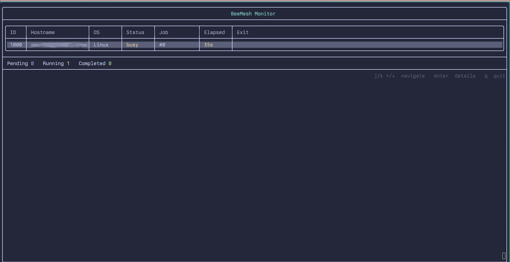

# beemeshpp

[BeeMesh](https://github.com/dhanushenoy/beemesh) implementation in C++

A distributed task execution system where a central **hive** receives jobs and dispatches them to connected **bee** nodes across the network.

# Why ?

- **Distributed Computing**: BeeMesh enables users to harness the power of multiple machines for parallel task execution,
  making it ideal for workloads that can be distributed across nodes.

- **Resource Management**: The hive can manage and allocate resources efficiently, ensuring that jobs are executed on
  suitable bees based on their capabilities and current load.

- **Scalability**: As the workload increases, more bees can be added to the network, allowing for seamless scaling of computational resources.

- **Flexibility**: Users can submit a wide variety of jobs, from simple shell commands to complex scripts, and the system will handle the distribution and
  execution across the network.

- **Monitoring**: The built-in monitoring dashboard provides real-time insights into the status of bees and jobs, allowing users to track progress and troubleshoot
  issues effectively.

## Building and Running

```bash
cmake -B build
cmake --build build
cd build
./beemesh
```

## Usage

### Start the hive

The hive accepts connections from bees and launchers. Run this on the machine that will coordinate work:

```bash
beemesh hive --host 0.0.0.0 --port 9000 --auth-token mytoken
```

To benchmark each bee when it registers (measures CPU GFLOPS and memory bandwidth before it accepts jobs):

```bash
beemesh hive --host 0.0.0.0 --port 9000 --auth-token mytoken --benchmark
```

### Register a bee

Bees connect to the hive and wait for jobs to execute. Run this on each worker machine:

```bash
beemesh bee --host <hive-ip> --port 9000 --auth-token mytoken
```

### Submit a job

The `launch` command submits work to the hive from any machine. Jobs are dispatched to an idle bee and executed there.

**Shell command:**
```bash
beemesh launch --host <hive-ip> --port 9000 --payload "uname -a"
```

**Local script or executable** (file is copied to the bee and run there):
```bash
beemesh launch --host <hive-ip> --port 9000 --payload ./my_script.sh
beemesh launch --host <hive-ip> --port 9000 --payload /path/to/script.py
```

Results are printed on the hive once the bee finishes execution.

**Job directives** (`#BEEMESH`) can be embedded in scripts to specify resource requirements. The hive will only dispatch the job to a bee that satisfies them:

```bash
#!/bin/bash
#BEEMESH --name my-analysis
#BEEMESH --cpus 4
#BEEMESH --mem 16G
#BEEMESH --gpu
#BEEMESH --target my-hostname

python train.py
```

| Directive | Description |
|---|---|
| `--name <string>` | Human-readable job name shown in the monitor |
| `--cpus <n>` | Minimum CPU cores required |
| `--mem <size>` | Minimum RAM required (`512M`, `16G`, etc.) |
| `--gpu` | Requires a bee with a GPU |
| `--target <hostname>` | Pin job to a specific bee by hostname |
| `--min-gflops <n>` | Minimum CPU benchmark score required (GFLOPS) |
| `--min-mem-bw <n>` | Minimum memory bandwidth required (GB/s) |

Jobs stay queued until a bee satisfying all directives is available. When multiple bees are eligible, the hive picks the one with the highest benchmark score (`cpu_gflops + mem_bandwidth_gbps`). Benchmark-based directives and scoring require the hive to be started with `--benchmark`.

### Monitoring

The hive provides a live dashboard to see connected bees, their status, and job stats:

```bash
beemesh monitor --host <hive-ip> --port 9000
```

| Key | Action |
|---|---|
| `j` / `↓` | Move selection down |
| `k` / `↑` | Move selection up |
| `Enter` | Open detail panel (job output, exit code, benchmark scores) |
| `Esc` / `Enter` | Close detail panel |
| `q` | Quit |


